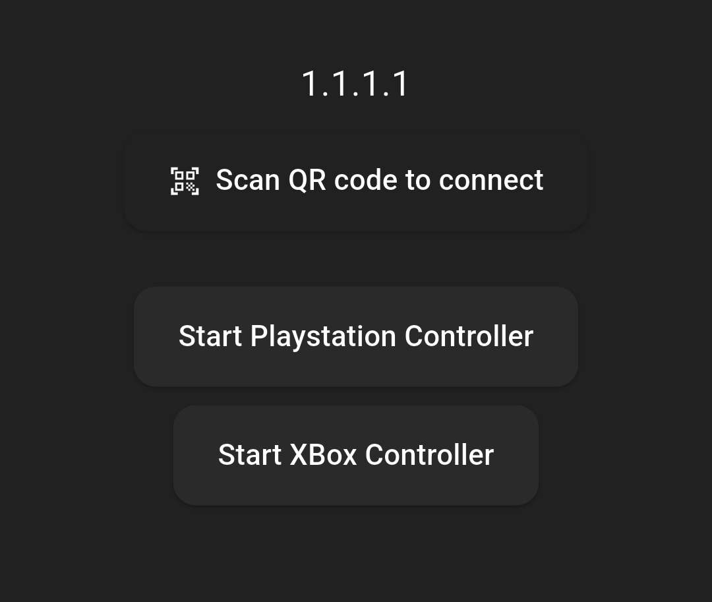
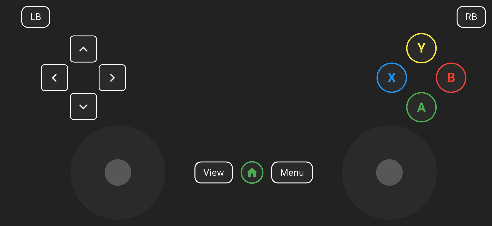
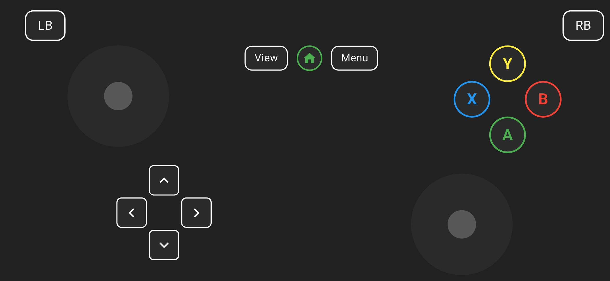
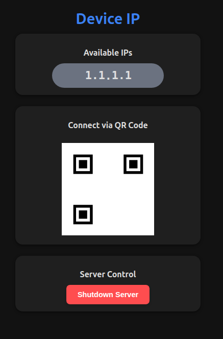

# Cheaptroller

Cheaptroller is a **lightweight controller application** that transforms your mobile device into a versatile PC game controller. It eliminates the need for extra hardware by connecting your phone to a small, local **Node.js server** that bridges the mobile inputs to your PC using a custom **C++ library for input simulation**.

The project's goal is simple: provide an easy, zero-cost way to control PC games using a device you already own.

The **Cheaptroller** app is currently confirmed to be functional and tested only on **Linux systems** because its core C++ input simulation library is Linux-specific, and there is **no support** for **Windows or macOS** at this time.

## Table of Contents

1.  [Key Features](#1-key-features)
2.  [Installation & Setup](#2-installation--setup)
3.  [Screenshots and User Interface (UI)](#3-screenshots-and-user-interface-ui)
4.  [Technologies](#4-technologies)
5.  [Usage & Controls](#5-usage--controls)
6.  [Troubleshooting](#6-troubleshooting)
7.  [Roadmap / To-Do](#7-roadmap--to-do)
8.  [License](#8-license)
9.  [Acknowledgements / Credits](#9-acknowledgements--credits)

## 1. Key Features

- **Standard Layouts:** Choose between **PlayStation** and **Xbox** controller layouts.
- **Easy Connection:** Quickly connect the mobile app to the server using a **QR Code**.
- **True Simulation:** The app acts as a **real controller**, ensuring recognition by games and platforms like **Steam**.

## 2. Installation & Setup

### Mobile Application

1.  **Download:** Get the **APK** file on your phone.
2.  **Install:** Install the application.
3.  **Launch:** Open the app—it should be ready to connect.

### PC Server

1.  **Download:** Grab the server binary from the project's releases.
2.  **Permissions:** Give the file executable rights via the terminal:
    ```bash
    chmod +x Backend_controler
    ```
3.  **Run:** Execute the file by double-clicking it or running it from the terminal. A browser with the configuration **dashboard** will automatically open.

**Important Notes:**

- Ensure your **firewall** is configured to allow **UDP traffic** for the server application.

## 3. Screenshots and User Interface (UI)

Cheaptroller's user interface is functional and designed to provide an authentic controller experience on the mobile device, while the backend allows for intuitive management.

| Description                                                                                                                                                                                                                             | Screenshot                                                                             |
| :-------------------------------------------------------------------------------------------------------------------------------------------------------------------------------------------------------------------------------------- | :------------------------------------------------------------------------------------- |
| **Main Page**                                                                                                                                                                                                                           |                             |
| The mobile app's start page serves as the central hub. Here, the connection to the PC server is established, either by entering the IP address or by using the quick QR code function.                                                  |
| **PlayStation Controller Layout**                                                                                                                                                                                                       |  |
| The PlayStation layout reproduces the typical symbols (Cross, Square, Triangle, Circle), along with the D-pad and analog sticks. This layout offers familiar controls for PS-oriented gamers.                                           |
| **XBox Controller Layout**                                                                                                                                                                                                              |                |
| The Xbox layout provides the A, B, X, and Y buttons as well as the precise arrangement of the analog sticks to simulate the feel of a real Xbox controller.                                                                             |
| **Server Dashboard (Web-UI)**                                                                                                                                                                                                           |             |
| The Dashboard opens in the browser after the Node.js server is started on the PC. It serves as a management interface for checking the connection status, IP address, and port, as well as for troubleshooting or future configuration. |

## 4. Technologies

| Component            | Technology             | Role                                                                           |
| :------------------- | :--------------------- | :----------------------------------------------------------------------------- |
| **Backend / Server** | **Node.js**            | Handles server communication and input translation using the **UDP protocol**. |
| **Frontend / App**   | **Flutter**            | Mobile application that captures and sends control data.                       |
| **PC Input Bridge**  | **Custom C++ Library** | Simulates controller input directly on the PC.                                 |

## 5. Usage & Controls

The button mapping follows a standard, real-world controller configuration.

| Action                  | Mapping                                                    |
| :---------------------- | :--------------------------------------------------------- |
| **Standard Buttons**    | Normal controller mapping                                  |
| **Big Bumpers (L3/R3)** | Accessed by **double-clicking** the corresponding joystick |

## 6. Troubleshooting

| Issue                 | Solution                                |
| :-------------------- | :-------------------------------------- |
| **Connection Issues** | Check IP address and firewall settings. |

## 7. Roadmap / To-Do

- Popup notifications for connection issues.
- Vibrational feedback on button press.

## 8. License

See the [LICENSE](LICENSE) file for details.
